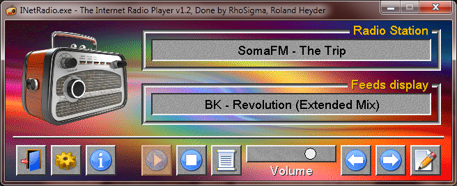

# GuiTools - A graphic UI framework for QB64
GuiTools is a ready to use program template/skeleton to create neat graphic UI applications with QB64, ie. to build your own UI forms you just need to add the desired object definitions into the template and the handler code which shall be called when your objects are triggered, while leaving all other parts of the template as is.

- GuiTools works with every QB64 version since v0.954, so if you're one of these normal people who not update to the latest build every week, that's not a problem. Just use whatever QB64 version you've installed, as long it's greater or equal to the 0.954 version. This also includes all [Phoenix Edition](https://github.com/QB64-Phoenix-Edition/QB64pe/releases) versions. But note although the GuiTools library works with v0.954, some applications made with it may require more recent versions of QB64(PE).

- GuiTools was developed with its main attention at dynamic UI creation, ie. you can easily create, modify and delete objects during runtime on the fly. There is intentionally no Designer tool here, as it would encourage people to build static UIs only. Although static UIs are quite legitimate here and there (and also possible with GuiTools), it would be a waste of GuiTools its capabilities.

- GuiTools can handle multiple forms in one program, each form in its very own independent window on your desktop, but all forms are still controlled in realtime by that one program, hence real multi-windows applications. As shown in the **Multi Windows Demo**, it's even possible to have interactions between several forms windows.

- GuiTools does already include a huge amount of useful functions, ready for use within your handler code. The range goes from general file and string handling functions to specialized functions like image processing and packing/unpacking. The inbuilt *MessageBox* and *FileOpenDialog* do perfectly fit into the GuiTools look and feel.

- GuiTools its UIs can be customized by every local user. Using the provided **Preferences Editor**, users can easily change colors, wallpapers and patterns of the GuiTools UIs without the need to recompile any applications.

Note that GuiTools does not implement the usual Windows like look and feel, but is inspired by the [AmigaOS](https://os.amigaworld.de/index.php?lang=en&page=16) versions 2.0 to 3.9, which have a simple yet elegant look (see pictures below).

----------

#### Download the latest Release v0.20 (August/2025) right here: [QB64GuiTools.7z](https://github.com/RhoSigma-QB64/QB64GuiTools/raw/main/QB64GuiTools.7z). The archive's GPG-Signature: [QB64GuiTools.7z.sig](https://github.com/RhoSigma-QB64/QB64GuiTools/raw/main/QB64GuiTools.7z.sig) (check against [RhoSigma's GPG-Key](https://github.com/RhoSigma-QB64/GPG-Key)).

>**Make sure to move the extracted QB64GuiTools folder with its entire contents into your QB64 installation folder. If you're new to GuiTools, then please also read the [GuiTools-Info.html](https://htmlpreview.github.io/?https://github.com/RhoSigma-QB64/QB64GuiTools/blob/main/QB64GuiTools/GuiTools-Info.html) file in the main folder for a short introduction of the project structure. See docs\ReleaseNotes.txt for latest changes.**

----------

# This is the usual look of GuiTools Applications

  

  

  

